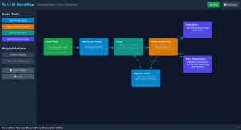

# LLM Interactive Workflow Builder

## Project Origin

This project was primarily generated by Google's Gemini Large Language Model through Google AI Studio. The human developer's role was mainly to provide high-level requirements, iteratively refine prompts, and perform extremely minor edits or fixes to the generated code. The core architecture, component structure, and feature implementation are largely the result of AI-driven code generation. This project has since been modified to use OpenAI's ChatGPT as an alternative LLM provider.

## A Note From the Human Involved

_This note, the file under Prompts, and some small edits are the total amount of 'code' effort I've put into this. To me, that is fantastic and I look forward to seeing this technology improve._

I saw the video [**AI Search - Gemini 2.5 has just levelled up**](https://youtube.com/watch?v=K0h_PS_1XiE) and was so impressed that I wanted to give it a try myself. Google's AI Studio is free and can apparently build quite complex web apps from simple prompts. I've included the majority of prompts I used in the Prompts folder but did not realise the conversation history is reset so some were lost.

At one point, Gemini became stuck on a bug where the interface would disappear after the app's workflow finished running and all elements disapeared and I thought that was the end of it - vibe coded into a corner. Surprisingly, it did fix the bug after several prompts asking it and me suggesting where the issue might be.

The most surprising, or best, part of this for me is the fact that I would not have written this myself. I do not know React and have no desire to learn it but I can certainly dive into an existing, working, codebase and make minor changes to parts where the LLM made a little mistake or I disagree with the implementation. However, the changes I did end up making were just wording and editing the default JSON in services.ts.

I use Github Copilot all the time and it is an excellent auto-completer for building out existing code but I do have to modify almost every suggestion to make it fit. The fact Gemini can build this project from nothing is impressive and the fact it actually works is truly shocking. What Google have done here is amazing and I'm sure the other big players will put their own tools in place soon enough but by far this AI Studio surpasses what I've seen with other AI code generation.

### Running
The initial instructions the LLM gave were to run `npm install` and then `npm run dev` but it seems to have changed its mind when creating [**build.md**](./build.md)

### LLMs

You can use this with ChatGPT or Ollama. Getting Ollama to work was a little frustrating because I was working across multiple machines. Here's the command that worked for me:

`env OLLAMA_HOST=192.168.0.1:8080 OLLAMA_ORIGINS=* OLLAMA_MODELS=/usr/share/ollama/.ollama/models/ ollama serve`

This sets the required environment variables, but only for that instance. Setting the host IP made it accessible to other machines on the network and setting the port was necessary because the browser blocked the default one. I set the origin to allow anything so it didn't matter how I ran the site locally. Finally, the Ollama server gave a 404 in response to every model name because it was looking in the wrong place so I had to set the model path.

## Overview

The LLM Interactive Workflow Builder is a web-based application that allows users to design, build, and run multi-step workflows interacting with LLMs like OpenAI's ChatGPT or local models via Ollama. Users can visually create a chain of operations, including prompting the LLM, storing results in variables, and making conditional decisions based on LLM outputs. This enables the creation of sophisticated, automated prompt engineering sequences.

### How it Works: A Simple Example - "Story Improver"

1.  **Create a Project**:
    *   On the Home Page, click "Create New Project". You'll be taken to the Project Editor.

2.  **Add a Start Node**:
    *   A "Start Node" is created by default. Click on it to open the editor.
    *   **Name**: `Initial Story Idea`
    *   **Prompt**: `Write a very short, one-sentence story about a brave knight.`
    *   Close the node editor.

3.  **Add a Prompt Node**:
    *   From the "Node Tools" sidebar, click "Add Prompt Node". A new node appears on the canvas.
    *   Click this new node to edit it.
    *   **Name**: `Make it Dramatic`
    *   **Prompt**: `Take the following story: {PREVIOUS_OUTPUT}. Now, rewrite it to be more dramatic and add a mysterious creature.`
    *   **Next Node**: (Leave as "None" for now, or if you add a Conclusion node next, select it here).

4.  **Add a Variable Node (Optional but good practice)**:
    *   Click "Add Variable Node".
    *   **Name**: `dramaticStory` (this is the variable name, e.g. `{dramaticStory}`)
    *   **Variable Description**: `Stores the dramatic version of the story.`
    *   Click "Save Node".

5.  **Add a Conclusion Node**:
    *   From the "Node Tools" sidebar, click "Add Conclusion Node".
    *   Click this new node to edit it.
    *   **Name**: `Final Story Output`
    *   **Display Title**: `The Epic Tale:` (This title will appear above the final LLM output for this node).
    *   Click "Save Node".

6.  **Link the Nodes**:
    *   Open the `Initial Story Idea` (Start) node. Set its "Next Node" to `Make it Dramatic` (Prompt Node). Save.
    *   Open the `Make it Dramatic` (Prompt) node. Set its "Next Node" to `dramaticStory` (Variable Node). Save.
    *   Open the `dramaticStory` (Variable) node. Set its "Next Node" to `Final Story Output` (Conclusion Node). Save.
    *   You should now see visual arrows connecting your nodes on the canvas: `Initial Story Idea` -> `Make it Dramatic` -> `dramaticStory` -> `Final Story Output`.

7.  **Configure API Key (for ChatGPT)**:
    *   Click "Settings" in the header.
    *   Select "ChatGPT (OpenAI)" as the LLM Provider.
    *   Enter your OpenAI API Key in the "ChatGPT API Key" field.
    *   Select your desired ChatGPT Model.
    *   Save the settings.

8.  **Run the Project**:
    *   Click the "Run" button in the header.
    *   The Execution Status Panel at the bottom will show the progress.
    *   The `Initial Story Idea` node runs, its output (a one-sentence story) is passed to `Make it Dramatic`.
    *   The `Make it Dramatic` node uses that story in its prompt, and its output (the dramatized story) is passed to the `dramaticStory` Variable Node.
    *   The `dramaticStory` Variable Node stores this output.
    *   The `Final Story Output` (Conclusion) node receives the value from `dramaticStory` and displays it under its title.
    *   The `lastRunOutput` field on each processed node will update with the text it generated or stored.

## Real-World Use Case: Dynamic Content Generation

Imagine a system for generating personalized marketing email snippets.

1.  **Start Node**: `Generate a product highlight for {productName} targeting a {customerSegment}. Focus on {keyBenefit}.` (Placeholders `{productName}`, `{customerSegment}`, `{keyBenefit}` would be workflow inputs, perhaps manually entered or from a CRM in a more advanced setup. For this app, they could be hardcoded or set by preceding Variable nodes filled by initial user input).
2.  **Variable Node**: Named `initialSnippet`. Stores the output from the Start Node.
3.  **Prompt Node (Tone Adjustment)**: `Review this snippet: {initialSnippet}. Rewrite it in a more {desiredTone} tone. Options for tone: enthusiastic, professional, urgent.` (Let's assume `{desiredTone}` is another input).
4.  **Variable Node**: Named `tonedSnippet`. Stores the tone-adjusted snippet.
5.  **Conditional Node (Length Check)**:
    *   **Prompt**: `Is the following snippet too long (more than 50 words)? Snippet: {tonedSnippet}. Respond with only "Yes" or "No".`
    *   **Branches**:
        *   Condition: `Yes` -> Next Node: `Shorten Snippet` (Prompt Node)
        *   Condition: `No` (or `default`) -> Next Node: `Final Email Snippet` (Conclusion Node)
6.  **Prompt Node (Shorten Snippet)**: `Make this snippet more concise, keeping the core message: {tonedSnippet}.`
7.  **Variable Node**: Named `finalSnippetContent`. This node would receive input from either the `Shorten Snippet` node (if length check was "Yes") or the `tonedSnippet` variable node (if length check was "No" - requiring an intermediary Variable node or direct linking if the Conditional logic supported passing through). *A more robust design might have the Conditional node point to different Variable nodes or directly to a common Conclusion node.* For this example, let's assume it feeds into a common variable.
8.  **Conclusion Node (Final Email Snippet)**: Displays the content from `{finalSnippetContent}`.

This workflow automates several steps of content creation and refinement, allowing for dynamic generation based on inputs and LLM-driven checks.

## Local Development

For instructions on how to set up and run this project on your local machine, please see the [**Building and Running the Project Locally (build.md)**](./build.md) guide.

## Security Vulnerabilities & Considerations

*   **API Key Storage (Major Vulnerability)**:
    *   The ChatGPT API Key (and any other cloud provider keys) is stored in the browser's `localStorage` when entered via the UI. This is **highly insecure for production environments**.
    *   `localStorage` is accessible via JavaScript on the same domain. If the application has any Cross-Site Scripting (XSS) vulnerabilities, an attacker could steal the API key.
    *   Malicious browser extensions installed by the user could also potentially access `localStorage`.
    *   **Recommendation**: For any real-world deployment beyond personal, local use, API keys **must not** be handled client-side. A backend proxy should be implemented to manage API keys securely and make requests to cloud LLM APIs on behalf of the client. Ollama, being local, has different security considerations typically managed by network access to the Ollama server.

*   **Prompt Injection**:
    *   Prompts can include values from previous node outputs (`{PREVIOUS_OUTPUT}`) and user-defined variables (`{variableName}`). If these inputs are not carefully managed or sanitized (especially if they originate from external, untrusted sources in a more complex application), there's a risk of prompt injection.
    *   An attacker could craft inputs that manipulate the LLM into ignoring its original instructions or executing unintended commands, potentially leading to undesired outputs or data leakage if the LLM has access to sensitive information within the prompt context.
    *   **Recommendation**: Be mindful of the data sources for variables. If integrating external inputs, consider sanitization or strict validation. For critical applications, implement additional layers of defense against prompt injection.

*   **No Server-Side Validation**:
    *   All logic, including workflow execution and node processing, happens client-side. There's no server-side validation of project structures or inputs. This is typical for a client-side-only application but would be a concern in a multi-user or production system.

*   **Cross-Site Scripting (XSS)**:
    *   While standard React practices and Tailwind help mitigate XSS, care must be taken if directly rendering LLM outputs or user-defined node content (like names or descriptions) as HTML without proper sanitization. The current implementation generally seems to render text content safely, but this is an ongoing concern for any web application.
    *   **Recommendation**: Always sanitize or properly escape any user-provided or LLM-generated content that is rendered as HTML.

## Suggestions for Future Extensions

This project provides a solid foundation. Developers could extend it in many ways:

*   **Backend Integration**:
    *   **Secure API Key Management**: Store API keys securely on a server and proxy API calls.
    *   **Persistent Storage**: Use a database (e.g., PostgreSQL, MongoDB) to store projects and user data instead of `localStorage`.
    *   **User Accounts & Authentication**: Allow users to sign up, log in, and save their projects privately.

*   **Enhanced Workflow Capabilities**:
    *   **Advanced Node Types**:
        *   _Code Execution Node_: Run custom JavaScript/Python snippets.
        *   _API Call Node_: Make arbitrary HTTP requests to other services.
        *   _Data Transformation Node_: Manipulate data (JSON parsing, regex, etc.).
        *   _Image Generation Node_: Integrate with models like DALL-E (OpenAI) or others.
        *   _Tool/Function Calling Node_: For more complex interactions with external tools via LLMs that support it.
    *   **Looping Constructs**: Explicit "Loop" or "Iterator" nodes.
    *   **Error Handling & Retry Logic**: Configure retry attempts and fallback paths within nodes.
    *   **Streaming Output**: For long-running LLM tasks, stream the output to the UI in real-time.
    *   **Parallel Execution**: Allow branches of a workflow to execute in parallel.

*   **Improved User Experience & Interface**:
    *   **Canvas Enhancements**: Minimap for large workflows.
    *   **Advanced Link Routing**: More sophisticated visual link paths to avoid overlaps.
    *   **Theming**: Light/dark mode or customizable themes.
    *   **Copy/Paste Nodes**: Duplicate nodes or sections of a workflow.
    *   **Undo/Redo**: For editor actions.

*   **Collaboration & Sharing**:
    *   **Project Sharing**: Allow users to share their projects with others (read-only or editable).
    *   **Real-time Collaboration**: Multiple users editing a project simultaneously.
    *   **Import/Export Projects**: Save and load projects as JSON files.

*   **Project Management & Organization**:
    *   **Versioning**: Save and revert to previous versions of a project.
    *   **Folders/Tagging**: Organize projects more effectively.

*   **Testing & Debugging**:
    *   **Workflow Validation**: Check for common errors (e.g., orphaned nodes, cyclic dependencies if not desired).
    *   **Step-Through Debugging**: Run the workflow node by node, inspecting inputs/outputs.
    *   **Mock Node Outputs**: Define mock outputs for nodes during testing without calling the LLM.

*   **Advanced Variable Management**:
    *   **Variable Scopes**: Global vs. local (node-specific) variables.
    *   **Data Types for Variables**: Enforce or suggest types for variables.
